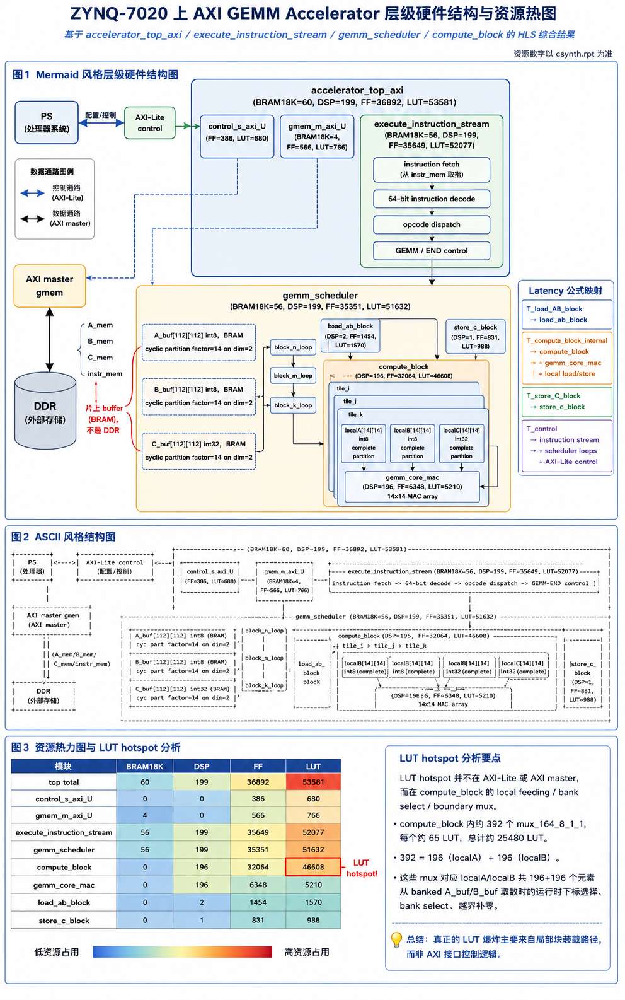
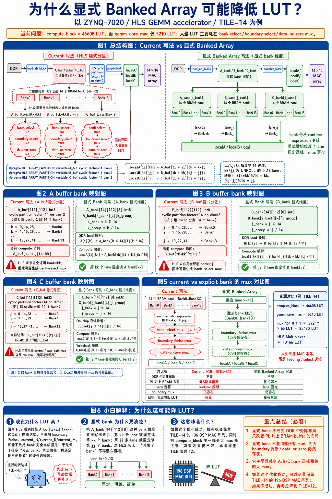

# Hardware ASCII Diagram Explanation

这篇文档专门解释日志和图片里的硬件 ASCII 图。重点不是画得好看，而是把当前 AXI GEMM accelerator 的控制路径、数据路径、片上 buffer、MAC array 和 explicit banked array 的关系讲清楚。

参考图：





## 1. 最外层系统图

当前板级链路可以先看成：

```text
PS
  |
  | AXI-Lite control
  v
accelerator_top_axi
  |
  | AXI master / HP
  v
DDR
```

这里要分清两条路：

```text
控制路径:
  PS -> AXI-Lite -> accelerator_top_axi control registers

数据路径:
  accelerator_top_axi -> AXI master -> DDR
  DDR -> AXI master -> accelerator_top_axi
```

所以 AXI-Lite 只负责配置和启动，不搬大矩阵。A/B/C 矩阵和 instruction stream 都在 DDR 里，通过 AXI master 访问。

## 2. 顶层模块层级

把 `accelerator_top_axi` 展开，可以写成：

```text
accelerator_top_axi
  |
  +-- control_s_axi_U
  |     AXI-Lite control register logic
  |
  +-- gemm_m_axi_U
  |     AXI master adapter
  |
  +-- execute_instruction_stream
        |
        +-- instruction fetch
        +-- 64-bit instruction decode
        +-- opcode dispatch
        +-- GEMM / END control
        |
        +-- gemm_scheduler
              |
              +-- load_ab_block
              +-- compute_block
              +-- store_c_block
```

这张图说明一个关键点：

```text
instruction decode 和 AXI 接口不是 LUT 最大来源；
真正的资源热点在 gemm_scheduler 里的 compute_block。
```

log25 前后的资源数字可以这样读：

| 模块 | generic LUT | boundary hoist LUT | explicit banks LUT |
| --- | ---: | ---: | ---: |
| `accelerator_top_axi` | 53581 | 23708 | 22887 |
| `execute_instruction_stream` | 52077 | 22204 | 21383 |
| `gemm_scheduler` | 51632 | 21759 | 20938 |
| `compute_block` | 46608 | 16735 | 15604 |
| `gemm_core_mac` | 5210 | 5210 | 5210 |

结论是：

```text
LUT 从 top 一路集中到 gemm_scheduler，再集中到 compute_block；
gemm_core_mac 本身只有 5210 LUT，不是这次爆 LUT 的大头。
```

## 3. 数据路径 ASCII 图

完整 GEMM 数据路径可以写成：

```text
DDR A_mem/B_mem/C_mem/instr_mem
  |
  | AXI master
  v
accelerator_top_axi
  |
  v
execute_instruction_stream
  |
  | decode GEMM instruction
  v
gemm_scheduler
  |
  +-- load_ab_block
  |     DDR A/B -> A_buf/B_buf
  |
  +-- compute_block
  |     A_buf/B_buf/C_buf -> localA/localB/localC
  |     localA/localB/localC -> gemm_core_mac
  |     gemm_core_mac -> localC -> C_buf
  |
  +-- store_c_block
        C_buf -> DDR C
```

其中 `A_buf/B_buf/C_buf` 是片上 BRAM，不是 DDR。它们的作用是把一块 `112 x 112` 的数据放在 PL 里，让后面的 `14 x 14` MAC array 重复使用。

如果画得更像硬件层级：

```text
                 +----------------------+
PS  --AXI-Lite-->| accelerator_top_axi  |
                 |                      |
DDR <-AXI master>|  execute_instruction |
                 |        stream        |
                 |          |           |
                 |          v           |
                 |   gemm_scheduler     |
                 |    |      |      |   |
                 |  load  compute store |
                 +----------------------+
```

## 4. compute_block 内部图

`compute_block` 内部主要是三层：

```text
A_buf/B_buf/C_buf
  |
  v
localA[14][14] / localB[14][14] / localC[14][14]
  |
  v
gemm_core_mac
  |
  v
localC[14][14]
  |
  v
C_buf
```

tile 循环可以写成：

```text
for ti in block rows by 14:
  for tj in block cols by 14:
    read localC tile
    for tk in block K by 14:
      load localA tile
      load localB tile
      14 x 14 MAC
    write localC tile
```

这对应 latency 文档里的：

```text
localC read -> localA load -> localB load -> gemm_core_mac -> localC write
```

当前 compute latency 没变，就是因为这个循环顺序没有变。

## 5. generic buffer 写法为什么容易出 mux

generic 写法里，片上 buffer 是二维数组，再让 HLS 做 cyclic partition：

```text
A_buf[112][112] int8
B_buf[112][112] int8
C_buf[112][112] int32

A_buf: cyclic partition factor=14 on dim=2
B_buf: cyclic partition factor=14 on dim=2
C_buf: cyclic partition factor=14 on dim=2
```

compute 访问大概是：

```text
localA[ii][kk] = A_buf[ti + ii][tk + kk]
localB[kk][jj] = B_buf[tk + kk][tj + jj]
localC[ii][jj] = C_buf[ti + ii][tj + jj]
```

从数学上说，`tk` 和 `tj` 都按 14 递增，所以：

```text
(tk + kk) % 14 = kk
(tj + jj) % 14 = jj
```

也就是说，每个 unrolled lane 本来应该访问固定 bank。

但 HLS 在面对运行时 index、边界判断、data-or-zero 和 partial sum 状态时，不一定能把这个关系完全化简。结果就是它可能生成：

```text
bank select mux
boundary select mux
data-or-zero mux
```

log25 之前最典型的是：

```text
mux_164_8_1_1: 392 个
每个约 65 LUT
总计 392 x 65 = 25480 LUT
```

这里的 `392` 可以理解成：

```text
localA 有 14 x 14 = 196 个 int8 元素
localB 有 14 x 14 = 196 个 int8 元素
196 + 196 = 392
```

这就是为什么 LUT hotspot 看起来在 `compute_block`，但不是 MAC array 自己，而是喂给 MAC array 的数据选择逻辑。

## 6. boundary hoist 图应该怎么理解

boundary hoist 的核心思想是：

```text
把边界判断尽量前移到 load 阶段；
让 compute 阶段看到的 A/B buffer 尽量已经是 padded 后的合法数据。
```

也就是原来 compute 里可能每个 localA/localB 元素都做：

```text
if in_range:
  use real data
else:
  use 0
```

hoist 后变成：

```text
load 阶段先把越界位置写成 0；
compute 阶段直接读 buffer。
```

所以 `generic -> boundary hoist` 能把最大那批 `mux_164_8_1_1` 消掉。这也是为什么 top LUT 从 `53581` 降到 `23708`，主要收益来自 compute_block。

## 7. explicit banked array 图应该怎么理解

explicit banks 不是改变 DDR 里的矩阵布局，而是改变 PL 片上 buffer 的布局。

原来的片上布局是：

```text
A_buf[112][112]
B_buf[112][112]
C_buf[112][112]
```

explicit banks 后变成：

```text
A_bank[14][112][8]
B_bank[14][112][8]
C_bank[14][112][8]
```

其中：

```text
14 = bank/lane 数
112 = block 的行或 K 维
8 = 112 / 14，也就是 group 数
```

A 的映射是：

```text
A[i][k] -> A_bank[k % 14][i][k / 14]
```

compute 里因为 `tk` 是 14 的倍数：

```text
localA[ii][kk] = A_bank[kk][ti + ii][tk / 14]
```

B 的映射是：

```text
B[k][j] -> B_bank[j % 14][k][j / 14]
```

compute 里因为 `tj` 是 14 的倍数：

```text
localB[kk][jj] = B_bank[jj][tk + kk][tj / 14]
```

C 的映射是：

```text
C[i][j] -> C_bank[j % 14][i][j / 14]
```

compute 和 store 里可以写成：

```text
localC[ii][jj] = C_bank[jj][ti + ii][tj / 14]
C_bank[jj][ti + ii][tj / 14] = localC[ii][jj]
```

这样写的好处是：第 `kk` 个 A lane 固定读 `A_bank[kk]`，第 `jj` 个 B/C lane 固定读写 `B_bank[jj]` 或 `C_bank[jj]`。HLS 不需要再从 14 个 bank 里动态选择那么多次。

## 8. 为什么 explicit banks 只算小优化

log25 的实际结果是：

```text
boundary hoist -> explicit banks

compute_block LUT: 16735 -> 15604，减少 1131
load_ab LUT:       1570  -> 1674，增加 104
store_c LUT:       988   -> 1194，增加 206
top LUT:           23708 -> 22887，净减少 821
```

这说明：

```text
1. explicit banks 让 compute 访问更直接；
2. 但 load/store 需要负责二维布局和 banked 布局之间的转换；
3. 所以 load/store 外围地址逻辑会稍微变复杂；
4. 顶层最终还是净减少 821 LUT。
```

它没有改变 `gemm_core_mac`，所以：

```text
gemm_core_mac LUT 仍是 5210
compute_block latency 仍是 28865 cycles
14 x 14 MAC array 规模不变
```

这就是图里“降 LUT，不降 latency”的核心含义。

## 9. 读这类 ASCII 图的顺序

以后再看这种硬件图，可以按这个顺序：

```text
1. 先分 PS、AXI-Lite、AXI master、DDR 和 PL 内部；
2. 再分 control path 和 data path；
3. 再从 accelerator_top_axi 一层层展开到 scheduler；
4. 找资源热点时看 LUT 是否集中在某个子模块；
5. 如果热点在 compute_block，不要马上怪 DSP，先看 local feeding、banking、boundary mux；
6. 如果 latency 没变，说明循环结构和 stage schedule 大概率没变；
7. 如果 LUT 变了，说明数据选择、地址、mux 或接口逻辑发生了变化。
```

对 log25 来说，最终解释就是：

```text
boundary hoist 消掉最大 A/B 边界 mux；
explicit banks 继续减少一部分 bank/address 相关逻辑；
MAC array 本身没变；
tile 调度没变；
所以资源下降，latency 基本不变。
```
