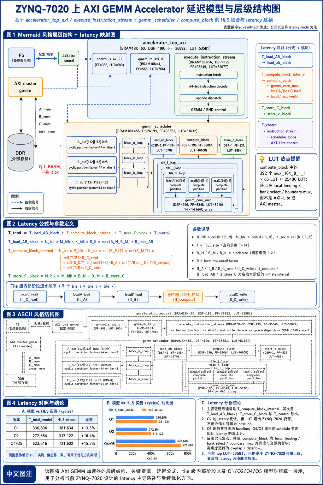

# Latency Model Formula Explanation

这篇文档把 log25 里出现的 latency 数字和公式单独整理出来。它不是新的实验日志，而是一个复习用说明：以后看到 HLS report 里的 top latency、module latency、loop latency 时，知道应该看哪一层，也知道为什么 log25 的 explicit banks 主要降 LUT，而不是明显降 latency。

参考图：



## 1. 先分清三层 latency

HLS report 里常见的 latency 不是只有一个数字。当前 AXI GEMM accelerator 至少要分三层看：

```text
第 1 层：top worst latency
  accelerator_top_axi / execute_instruction_stream / gemm_scheduler 顶层估计

第 2 层：block stage latency
  load_ab_block
  compute_block
  store_c_block

第 3 层：tile internal latency
  localC read
  localA/localB load
  gemm_core_mac
  localC write
```

log25 里顶层 1024 worst latency 是：

| 版本 | top worst latency cycles |
| --- | ---: |
| generic | 87755359000 |
| boundary hoist | 87755359000 |
| explicit banks | 87756826568 |

这个数很大，但它不适合作为 log25 的主要优化判断。原因是 `N/K/M` 都是运行时字段，HLS 会按循环上界做保守估计；而 explicit banks 改了 load/store 的索引形式，也会影响 HLS 的估计式。所以这轮我真正看的是单个 block 的 stage latency 和 compute 内部结构。

## 2. scheduler 层公式

当前 scheduler 的主循环结构可以简化成：

```text
for n0 in N blocks:
  for m0 in M blocks:
    for k0 in K blocks:
      load A/B block
      compute block partial sum
    store C block
```

所以没有做 block-level dataflow overlap 时，一个常用估算式是：

```text
B_N = ceil(N / BLOCK_N)
B_M = ceil(M / BLOCK_M)
B_K = ceil(K / BLOCK_K)

T_scheduler
  ~= B_N x B_M x (B_K x (T_load_AB_block + T_compute_block_internal)
                  + T_store_C_block)
     + T_control
```

当前 log25 的配置是：

```text
TILE = 14
BLOCK_N = 112
BLOCK_K = 112
BLOCK_M = 112
```

explicit banks 版本的单 block stage latency 是：

| 模块 | latency cycles |
| --- | ---: |
| `load_ab_block_banked` | 25102 |
| `compute_block_banked` | 28865 |
| `store_c_block_banked` | 12555 |

如果只看一个 `112 x 112 x 112` 完整 block，粗略 stage 总和是：

```text
T_one_block ~= 25102 + 28865 + 12555
            = 66522 cycles
```

如果粗略估一个固定 `1024 x 1024 x 1024` GEMM：

```text
B_N = ceil(1024 / 112) = 10
B_M = ceil(1024 / 112) = 10
B_K = ceil(1024 / 112) = 10

T_fixed_1024_rough
  ~= 10 x 10 x (10 x (25102 + 28865) + 12555)
  = 55222500 cycles
```

这个手算值只用于理解调度结构，不等价于 HLS top worst latency，也不等价于真实板上时间。真实板上还会受 AXI burst、DDR、cache flush/invalidate、IP 启停和 PS 侧等待方式影响。

## 3. compute_block 内部公式

`compute_block_banked` 的报告更适合解释为什么 latency 没变。当前一个 block 是 `112 x 112 x 112`，tile 是 `14 x 14`，所以：

```text
C tile 数量 = (112 / 14) x (112 / 14)
            = 8 x 8
            = 64

K tile 数量 = 112 / 14
            = 8
```

HLS report 里 compute 内部的关键数字是：

```text
compute tile_i/tile_j 总 latency = 28864 cycles
每个 output tile iteration latency = 451 cycles
每个 K tile iteration latency = 52 cycles
load localA = 14 cycles, II=1
load localB = 14 cycles, II=1
gemm_core_mac = 18 cycles
store localC = 14 cycles, II=1
```

对应到公式，可以先写成：

```text
T_compute_block_internal
  ~= T_C_tiles x T_one_C_tile

T_C_tiles
  = ceil(BLOCK_N / TILE) x ceil(BLOCK_M / TILE)

T_one_C_tile
  ~= T_localC_read
     + K_tiles x T_one_K_tile
     + T_localC_write

T_one_K_tile
  ~= T_localA_load + T_localB_load + T_gemm_core_mac + T_loop_control
```

代入当前数字：

```text
T_C_tiles = 64
T_one_C_tile = 451 cycles

64 x 451 = 28864 cycles
```

这和 report 里的 `compute_block_banked = 28865 cycles` 基本一致，差的 1 cycle 可以理解成函数入口、循环收尾或 HLS 调度边界带来的小开销。

## 4. 为什么 14x14 MAC 不是 14 cycles 结束全部计算

`gemm_core_mac` 是 `14 x 14` MAC array，理论并行 MAC 数是：

```text
compute_roof_mac_per_cycle = TILE x TILE
                           = 14 x 14
                           = 196 MAC/cycle
```

一个 `112 x 112 x 112` block 的总 MAC 数是：

```text
MAC_block = 112 x 112 x 112
          = 1404928 MAC
```

如果只按理想 compute roof 算，下界是：

```text
T_compute_min = MAC_block / 196
              = 7168 cycles
```

但 HLS report 里的 `compute_block_banked` 是：

```text
28865 cycles
```

所以 compute 阶段的实际平均吞吐是：

```text
actual_mac_per_cycle_compute
  = 1404928 / 28865
  ~= 48.68 MAC/cycle

compute_util
  = 48.68 / 196
  ~= 24.8%
```

这说明 `196` 个 DSP/MAC 并不是每个周期都在做有效乘加。它们会被 localA/localB load、localC read/write、循环控制、bank 访问、mux 和数据搬运节奏拖住。log25 的资源优化主要是在减少这些喂数路径上的 LUT，而不是改变 tile 调度节拍。

## 5. log25 三版 latency 对比怎么读

log25 里的 stage latency 对比是：

| 模块 | generic | boundary hoist | explicit banks |
| --- | ---: | ---: | ---: |
| `load_ab_block` / `load_ab_block_banked` | 25101 | 25101 | 25102 |
| `compute_block` / `compute_block_banked` | 28865 | 28865 | 28865 |
| `store_c_block` / `store_c_block_banked` | 12562 | 12562 | 12555 |

这个表的意思是：

```text
1. boundary hoist 主要减少边界判断相关 mux，所以 LUT 大幅下降；
2. explicit banks 主要减少一部分 bank/address expression 和小 mux；
3. 两者都没有改变 tile_i/tile_j/tile_k 的循环结构；
4. 因此 compute_block latency 基本不变。
```

换句话说，这一轮优化的主结论应该写成：

```text
资源优化有效，latency 基本不变。
```

如果后续要继续追 latency，方向就不应该再只盯 A/B bank select mux，而应该看：

```text
1. load/compute/store 是否能稳定 overlap；
2. localA/localB load 与 gemm_core_mac 是否能更紧密衔接；
3. localC 的 32-bit 读写和累加状态 mux 能不能减少；
4. 上板后 AXI master/DDR burst 是否成为新的瓶颈。
```

## 6. 和 roofline 公式的关系

以前的 roofline 模型把 GEMM 写成：

```text
MAC = N x K x M
ops = 2 x N x K x M

compute_roof_mac_per_cycle = TILE x TILE
compute_roof_ops_per_cycle = 2 x TILE x TILE
```

外部 memory 下界可以粗略写成：

```text
external_mem_cycles_min = external_bytes / ddr_bytes_per_cycle
compute_cycles_min      = MAC / compute_roof_mac_per_cycle
roof_cycles_min         = max(external_mem_cycles_min, compute_cycles_min)
latency_over_roof       = actual_latency / roof_cycles_min
```

但是 log25 更关注 HLS 内部资源，所以它不是在证明 DDR roofline，而是在说明：

```text
当前真正危险的 LUT hotspot 在 compute_block 的 local feeding / bank select / boundary mux。
```

因此 latency 公式和资源公式要一起看：

```text
Latency 看循环结构是否改变；
LUT 看数据路径上 mux 和地址选择是否减少。
```

log25 的 explicit banks 改了第二件事，没有明显改第一件事。
